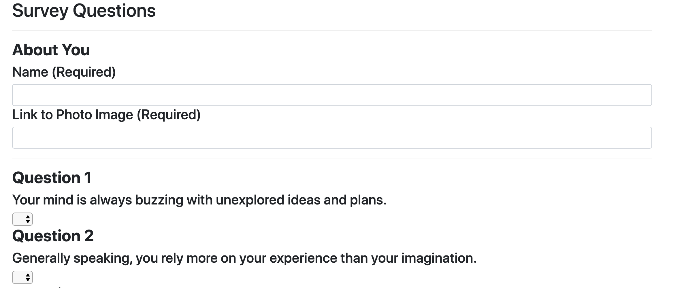

# FriendFinder - Psych!

The Friend Finder is a Psych themed application in which a user can answer survey questions to find the friend that the algorithm determines is most compatible. Upon determination of the most fit friend, a box containing the friends photo and name will be presented to the user. The user can also click links on the bottom of the page to view all friends currently in the database, or access the github repository containing the code for this application. 

The application was written using HTML, CSS, JavaScript, jQuery, express.js, node.js, and heroku.

To use the Friend Finder Application: 

    1) Click on deployed heroku link provided below to access application
    2) Click on the Survey button to begin the survey
    3) Simply fill out the survey and you receive a popup containing a friend that 
        the algorithm has determined is most compatible for you
    4) You will also have your information added so other friends can find you!

Deployed Heroku link: [Deployed Heroku](https://evening-inlet-95607.herokuapp.com/)
Link to the github repo: [GitHub Repo](https://github.com/nguyenj0215/FriendFinder)